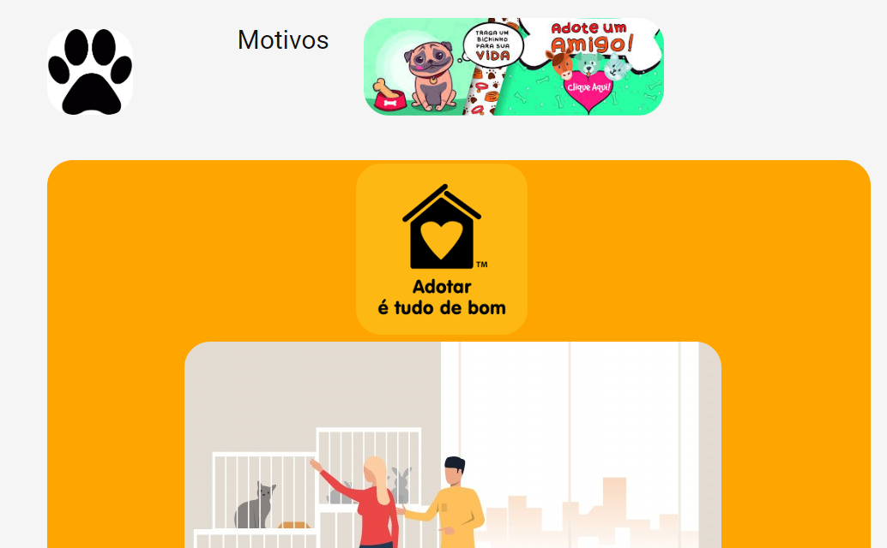

<h1 align="center">
    
</h1>

<h3 align="center">
  Desafio 2 - Projeto Adoção no Front-end
</h3>

<blockquote align="center">“Faça seu melhor, mas sempre com prazo de entrega!”</blockquote>

  <a>Projeto elaborado com a intenção de que as pessoas façam adoção de petz</a>;

## : Materiais

- [HTML]
- [CSS]
- [JAVASCRIPT]

## :rocket Expansion Week: Desafio 2

- [Pensar em um projeto]
- [Ter um mentor ou mentora para o seu projeto]
